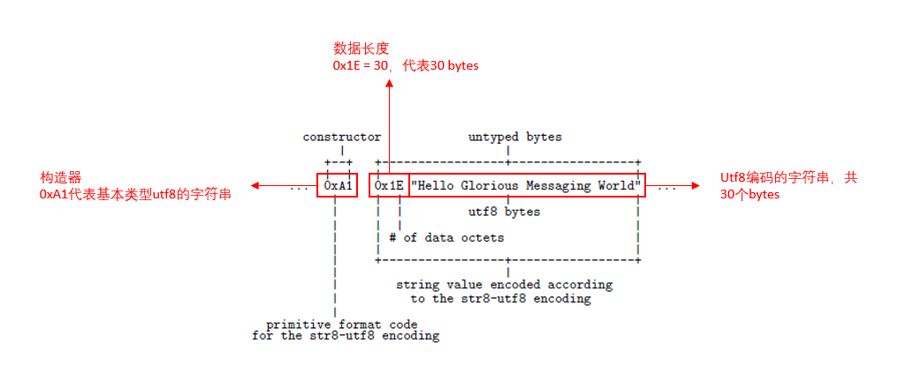

# 类型

## 1.1 类型系统

AMQP类型系统定义了一组用于数据互操作的常用基本类型。通过基本类型定义的AMQP值可以被额外的语义信息注解为更复杂的类型。通过注解的形式，可以将非AMQP基本类型表示的外部类型与AMQP基本类型相关联。例如，URL通常表示为字符串，但是并非所有字符串都是有效的URL，并且许多编程语言或应用程序需要特定的类型来表示URL。 当一个值表示URL时，AMQP类型系统允许定义相关的注解代码来描述该值。

### 1.1.1 基本类型（Primitive Types）

有如下的基本类型：

|  类型   |  描述  |
|  ----  | ----  |
| null  | 空值 |
| boolean | 单元格 |
| ubyte | 0 到 2<sup>8</sup> - 1，闭区间 |
| ushort | 0 到 2<sup>16</sup> - 1，闭区间 |
| uint | 0 到 2<sup>32</sup> - 1，闭区间 |
| ulong | 0 到 2<sup>64</sup> - 1，闭区间 |
| byte | -2<sup>7</sup> 到 2<sup>7</sup> - 1，闭区间 |
| short | -2<sup>15</sup> 到 2<sup>15</sup> - 1，闭区间 |
| int | -2<sup>31</sup> 到 2<sup>31</sup> - 1，闭区间 |
| long | -2<sup>63</sup> 到 2<sup>63</sup> - 1，闭区间 |
| float | 32位浮点数 (IEEE 754-2008 binary32) |
| double | 64位浮点数 (IEEE 754-2008 binary64) |
| decimal32 | [32位十进制浮点数](https://en.wikipedia.org/wiki/Decimal32_floating-point_format) (IEEE 754-2008 decimal32) |
| decimal64 | [64位十进制浮点数](https://en.wikipedia.org/wiki/Decimal64_floating-point_format) (IEEE 754-2008 decimal64) |
| decimal128 | [128位十进制浮点数](https://en.wikipedia.org/wiki/Decimal128_floating-point_format) (IEEE 754-2008 decimal128) |
| char | 单个Unicode编码的字符 |
| timestamp | 时间戳 |
| uuid | 一个全局唯一的id (由RFC-4122章节4.1.2定义) |
| binary | 二进制数据 |
| string | Unicode字符串 |
| symbol | 约束领域内定义的符号值 |
| list |  支持多类型（多态）的列表 |
| map | 支持多类型（多态）的字典 |
| array | 单一类型的数组 |

### 1.1.2 自定义描述类型 (Described Types)

AMQP定义的基本类型可以直接表示大多数流行编程语言中存在的许多基本类型，可以直接用于交换基本数据。但在实际应用中，即使是最简单的应用程序也具有一组用于在程序内对概念建模的自定义类型。对于消息服务应用程序，要传递这些自定义类型的数据就需要先将其外部化（表示成AMQP格式）。

AMQP允许使用描述符（descriptor）对任何AMQP类型进行注解的方法。描述符关联了自定义类型和AMQP类型，它表明AMQP类型实际上是自定义类型的外部化表示。 AMQP类型及其描述符两者结合被称为自定义描述类型。

一个自定义描述类型包含两种不同的类型信息，它同时识别AMQP类型和自定义类型（以及它们之间的关系），因此该类型可以被从两个不同的角度进行解析：业务处理的应用程序可以将该类型理解为普通的自定义类型，从而根据业务领域的完整语义对每个类型进行解码和处理；非业务处理的应用程序仍可以将上述类型理解为AMQP类型，并对其进行解码和处理。

### 1.1.3 描述符值(Descriptor Values)

除符号（symbol）和数值（ulong）以外的描述符值，包括ulong以外的数值类型，在语法上是有效且被保留的。为了避免描述符值之间的冲突，用户可以通过如下所描述的分配策略定义自己的类型系统描述符：

符号描述符和数值描述符的名称空间（namespace）被分为不同的域（domain）。 每个域具有AMQP作者划分的定义符号（以及可选的4字节数字ID）。 对于数字ID，分配的域ID等于[IANA](https://en.wikipedia.org/wiki/Internet_Assigned_Numbers_Authority)（http://www.iana.org/assignments/enterprise-numbers） 中的Private Enterprise Number (PEN)。域ID 0用于AMQP规范中定义的描述符。

描述符根据以下的规则在每个域中被分配：

符号描述符（symbolic descriptors）
    ```<domain>:<name>```

数值描述符（numeric descriptors）
    ```(domain-id<<32) | descriptor-id```

**译者注：请结合后面descriptor的示例去理解。**

## 1.2 类型编码

AMQP编码的数据流由带有嵌入式构造函数（constructor）的无类型字节（untyped bytes）组成。 嵌入式构造函数指示如何解释随后的未类型字节。 构造函数可以看作是从没有固定大小限制的节流中消耗无类型字节并构造有类型值的函数。 AMQP编码的数据流始终以构造函数开头。

AMQP编码的数据流由无类型字节组成，字节流中嵌入了构造器用于解析字节数据。 我们可以认为构造器是一种用于解析并构造类型值的函数，它从开放式的字节流中读取无类型字节。 AMQP编码的数据流始终以构造器开头。



<p align="center"> 图1-1 基本类型编码格式（utf8 string）</p>